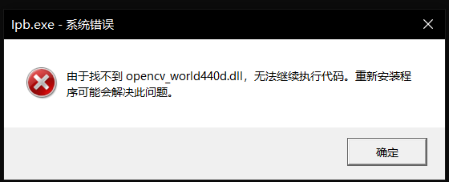

# Image Process for BMP

本项目为大二上学期（2020.9）《图像处理》课程作业一的实现，趁摸鱼的兴致整理出来。

#### 项目简介

本项目的c++版本**没有调用任何图像处理库函数来进行读取、显示、存储图像**，自己造轮子封装了一个类，能对**任意尺寸**的bmp格式图像进行以下操作：

+ 读取
+ 显示图像与对应颜色分布直方图
+ 存储
+ 将像素数据写入文本文件

matlab版本因为时间关系不太完善。也是因为时间关系，两份代码的直方图部分不太完善，有些bug。仅供参考。

虽然这个任务当时布置得有些离谱，没有考虑到超出了我们的能力范围，但是每天研究bmp的日子还是让我短暂地成为了bmp专家。当然现在已经忘得差不多了。

#### 知识总结

我当时整理的不同位深bmp图像的思维导图：

#### 演示视频

戳[这里](https://www.bilibili.com/video/BV1Su411R7yF/)

#### 可能遇到的问题

因项目大小限制没有一并上传。将`opencv_world440d.dll`这个文件放到`c++\x64\Debug`路径下即可。

