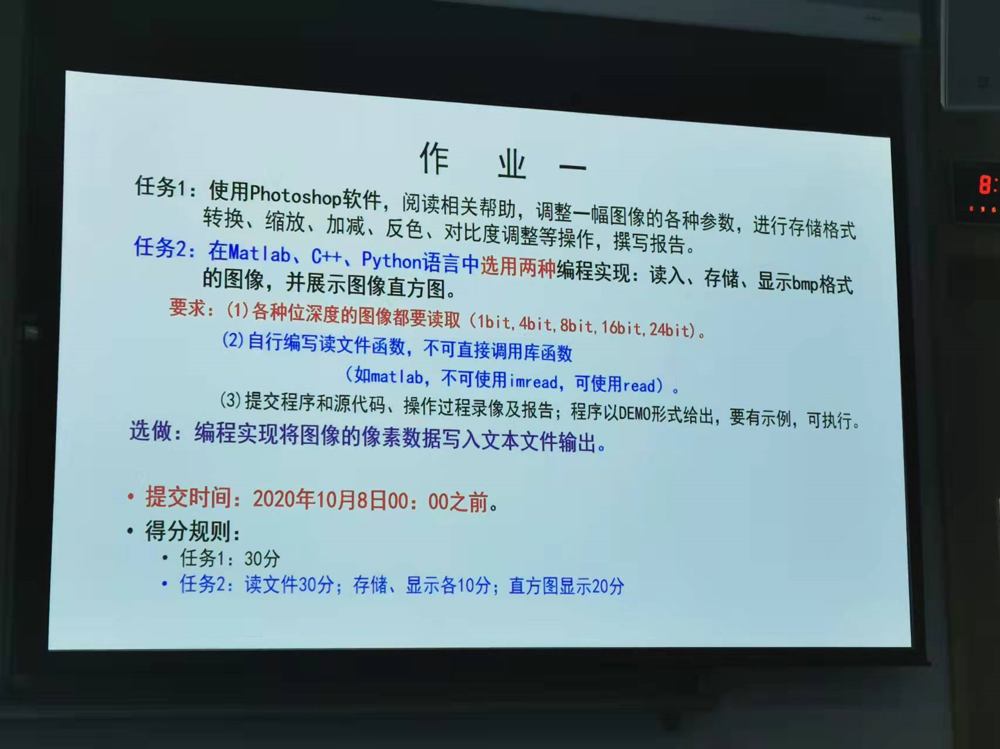
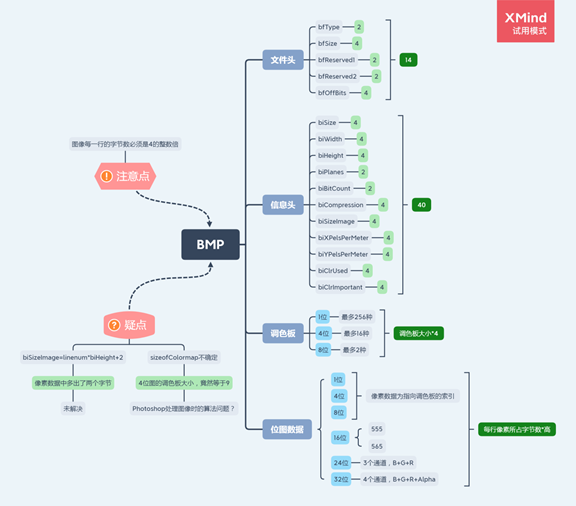

# Image Process for BMP

本项目为大二上学期（2020.9）《图像处理》课程作业一的实现，趁摸鱼的兴致整理出来。

本项目**没有调用任何图像处理库函数**，自己造轮子，能对bmp格式图像进行以下操作：

+ 读取
+ 显示图像与对应颜色分布直方图
+ 存储
+ 将像素数据写入文本文件

虽然这个任务当时布置得有些离谱，没有考虑到超出了我们的能力范围，但是每天研究bmp的日子还是让我短暂地成为了bmp专家。当然现在已经忘得差不多了。

我当时整理的不同位深bmp图像的思维导图：

